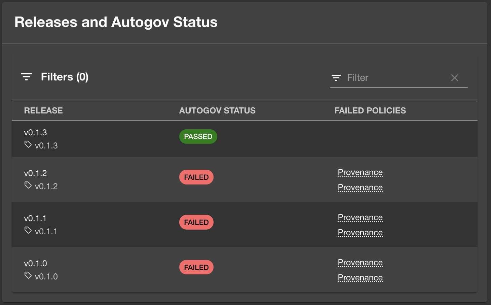
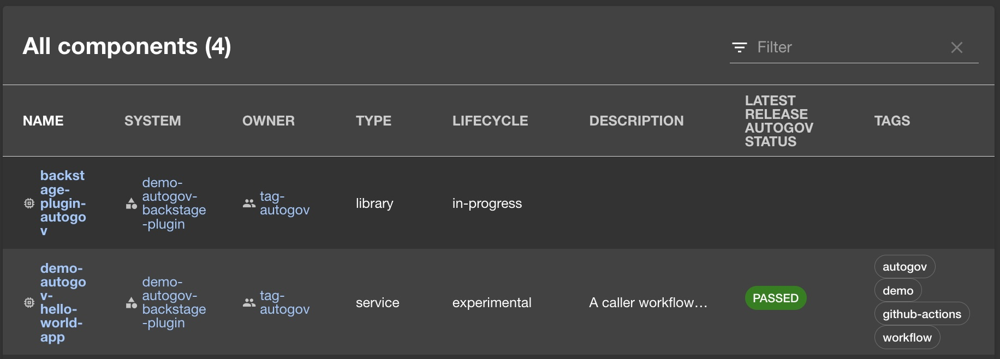
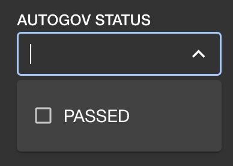

# Backstage Autogov Plugins

[](https://github.com/liatrio/backstage-plugin-autogov/actions/workflows/codeql.yml) [](https://opensource.org/licenses/Apache-2.0) [](https://github.com/liatrio/backstage-dora-plugin/actions/workflows/release.yml) 

This is a set of plugins for the [Backstage](https://backstage.io/) Project that will display Automated Governance results for the latest releases throughout the Backstage interface.

The results displayed are the Automated Governance results published to that releases assets.

> [!IMPORTANT]
> This plugin works with version 1.31.1 and higher of Backstage.

## Dependencies

The plugins will only look for Autogov results on repositories with the annotation `liatrio.com/autogov-status-file` set to `results`, or whatever the resulting policy output release asset file name is. It can only be overridden from the default value if allowed in the config.

The plugins will only display additional release contents if there is a release asset named according to the previously mentioned annotation or default file named `results`, and that file has `results` and `violations` objects formatted like the following:

```json
{
  "result": "PASSED",
  "violations": []
}
```

or

```json
{
  "result": "FAILED",
  "violations": [
    {
      "policy": "provenance",
      "message": "build type is not correct or missing"
    },
    {
      "policy": "provenance",
      "message": "predicate type is not correct or missing"
    },
    {
      "policy": "sbom",
      "message": "cyclonedx sbom is missing"
    }
  ]
}
```

> If `violations` object has items in the list, each violation item should have `policy` and `message` defined. There can be any number of violations in the list; each will be displayed.

## Autogov Releases and Autogov Status Card Plug-in

### Plugin Architecture

The plugin will implement a reusable card that can be included on various entity page locations.

For each entity the front end will call the backend plugin installed in Backstage to fetch the latest releases and autogov result asset each release. The frontend will display the contents of the results


### Components

#### AutogovReleasesCard

This offers Automated Governance results for each release that was created in compliance with an Automated Governance workflow (which should include publishing the policy results to the release assets).

The frontend will display the contents of the results plugin for the AutoGov status (pass/fail) and if failed, the failed policies are displayed. The failed policies title will display the rule message when hovered over.



### Installation into Backstage

#### Update Configuration

1. Add an autogov config section to your `app-config.yaml`

  ```yaml
  autogov:
    github:
      resultsFile:
        allowOverride: false
        default: "results"
      requireAnnotation: true
      entityKinds:
        - "component"
      entityTypes:
        - "website"
        - "service"
      maxReleasesResults: 5
  ```

1. Update GitHub integration if you have one

  ```yaml
  github:
    - host: github.com # or your github instance
      apiBaseUrl: https://api.github.com
      token: ${GITHUB_TOKEN}
  ```

#### Release Card install

1. To install to the Autogov Plugins to the appropriate place, run the following two commands:

  ```zsh
    # from root
    yarn --cwd packages/app add @liatrio/backstage-plugin-autogov-releases-card@^1.6.2
    yarn --cwd packages/backend add @liatrio/backstage-plugin-autogov-releases-backend@^1.6.2
  ```

#### Autogov Plug-in Release Card Backend

1. Update `packages/backend/src/index.ts` with:

`diff`

  ```diff
  +  backend.add(
  +    import('@liatrio/backstage-plugin-autogov-releases-backend'),
  +  );
  backend.start();
  ```

`copy paste`

  ```.ts
  backend.add(
    import('@liatrio/backstage-plugin-autogov-releases-backend'),
  );
  ```

#### Autogov Plug-in Release Card Frontend

1. Update `packages/app/src/components/catalog/EntityPage.tsx` with:

`diff`

  ```diff
    + import { AutogovReleasesCard } from '@liatrio/backstage-plugin-autogov-releases-card';
  ```

`copy paste`

  ```.tsx
  import { AutogovReleasesCard } from '@liatrio/backstage-plugin-autogov-releases-card';
  ```

1. Further down, find the following block of code:

`diff`

  ```diff
    const overviewContent = (
      <Grid container spacing={3} alignItems="stretch">
        {entityWarningContent}
        <Grid item md={6}>
          <EntityAboutCard variant="gridItem" />
        </Grid>
        <Grid item md={6} xs={12}>
          <EntityCatalogGraphCard variant="gridItem" height={400} />
        </Grid>

        <Grid item md={4} xs={12}>
          <EntityLinksCard />
        </Grid>
        <Grid item md={8} xs={12}>
          <EntityHasSubcomponentsCard variant="gridItem" />
        </Grid>
    +    <EntitySwitch>
    +      <EntitySwitch.Case
    +        if={isKind('component') && isComponentType(['website', 'service'])}
    +      >
    +        <Grid item md={8} xs={12}>
    +          <AutogovReleasesCard />
    +        </Grid>
    +      </EntitySwitch.Case>
    +    </EntitySwitch>
      </Grid>
    );
  ```

`copy paste`

  ```.tsx

      <EntitySwitch>
        <EntitySwitch.Case
          if={isKind('component') && isComponentType(['website', 'service'])}>
          <Grid item md={8} xs={12}>
            <AutogovReleasesCard />
          </Grid>
        </EntitySwitch.Case>
      </EntitySwitch>
  ```

## Autogov Releases and Autogov Status Column and Processor Plug-in

### Plugin Architecture

The plugin will implement an additional catalog column showing the latest releases Autogov Status.

This depends on a processor being added to the backend that will look at the latest release on a regular basis and append the status as an annotation on the entity.

The column will add results according to the value of that annotation.

### Components

#### createAutogovStatusCatalogColumn

This offers Automated Governance latest release status in a catalog column.

The column will display the contents of the results of the Autogov status (pass/fail) for the latest release. The statuses can be filtered as well.





### Installation into Backstage

1. To install to the Autogov Plugins to the appropriate place, run the following two commands:

   ```zsh
   # from root
   yarn --cwd packages/app add @liatrio/backstage-plugin-autogov-status-catalog-column@^1.6.2
   yarn --cwd packages/backend add @liatrio/backstage-plugin-backend-module-autogov-processor@^1.6.2
   ```

#### Autogov Plug-in Latest Release Autogov Status Catalog Processor

1. Update `packages/backend/src/index.ts` with:

`diff`

  ```diff
  +  backend.add(
  +    import('@liatrio/backstage-plugin-backend-module-autogov-processor'),
  +  );
  backend.start();
  ```

`copy paste`

  ```.ts
  backend.add(
    import('@liatrio/backstage-plugin-backend-module-autogov-processor'),
  );
  ```

#### Autogov Plug-in Latest Release Autogov Status Catalog Column

1. Update `packages/app/src/App.tsx`:

`diff`

  ```diff
  +  import {
  +    defaultColumnsWithAutogovStatusRightOf,
  +    AutogovLatestReleaseStatusPicker,
  +  } from '@liatrio/backstage-plugin-autogov-status-catalog-column';
  +  import { DefaultFilters } from '@backstage/plugin-catalog-react';

  const app = createApp({
  ```

`copy paste`

  ```.tsx
  import {
    defaultColumnsWithAutogovStatusRightOf,
    AutogovLatestReleaseStatusPicker,
  } from '@liatrio/backstage-plugin-autogov-status-catalog-column';
  import { DefaultFilters } from '@backstage/plugin-catalog-react';
  ```

1. Further down, find the following code block and update:

`diff`

  ```diff
  -      <Route path="/catalog" element={<CatalogIndexPage />} />
  +      <Route
  +        path="/catalog"
  +        element={
  +          <CatalogIndexPage
  +            columns={context =>
  +              defaultColumnsWithAutogovStatusRightOf('Description', context)
  +            }
  +            filters={
  +              <>
  +                <DefaultFilters />
  +                <AutogovLatestReleaseStatusPicker />
  +              </>
  +            }
  +          />
  +        }
  +      />
  ```

`copy paste`

  ```.tsx
      <Route
        path="/catalog"
        element={
          <CatalogIndexPage
            columns={context =>
              defaultColumnsWithAutogovStatusRightOf('Description', context)
            }
            filters={
              <>
                <DefaultFilters />
                <AutogovLatestReleaseStatusPicker />
              </>
            }
          />
        }
      />
  ```

## Configuration Options

The following configuration options are available for the the plugins in your `app-config.yaml` file:

### `github`

#### `resultsFile`

- **`allowOverride`** (boolean): Whether to allow override of default results file location. Default is `false`.
- **`default`** (string): Default name for the results file. Default is `"results"`.

#### `requireAnnotation` (boolean)

- Whether to require annotations for processing. Default is `true`.

#### `entityKinds` (array)

- Array of entity kinds to process. Default is `["component"]`.

#### `entityTypes` (array)

- Array of entity types to process. Default is `["website"]`.

#### `maxReleasesResults` (number)

- Maximum number of releases to show in autogov results. Default is `5`.

## Contributing

See [Contributing](./CONTRIBUTING) to Backstage GitHub Releases Autogov Plugin
